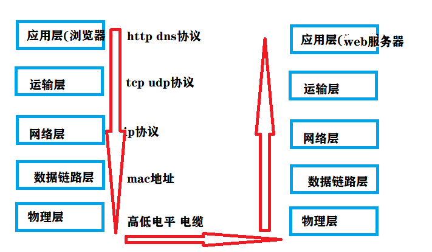
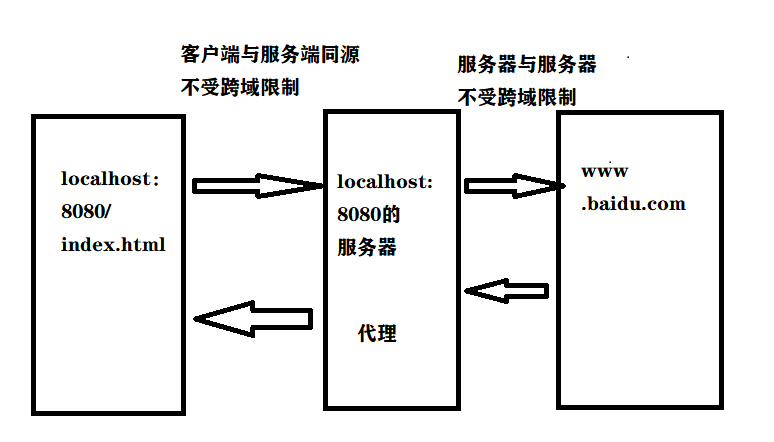
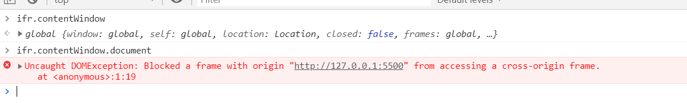
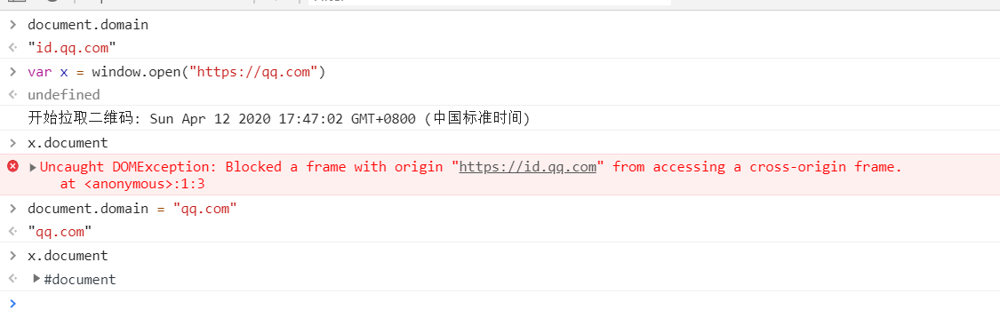
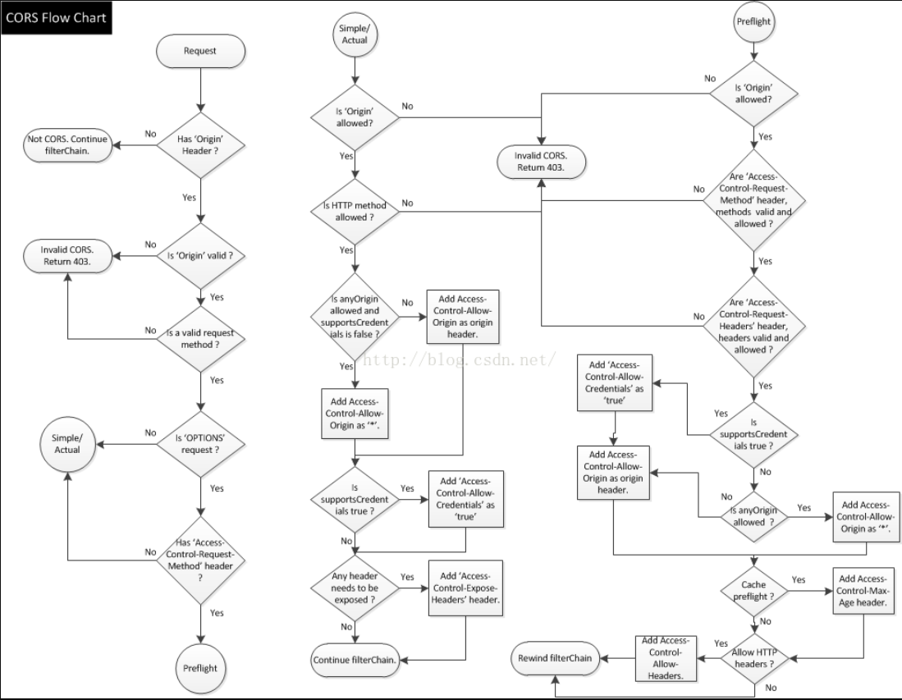
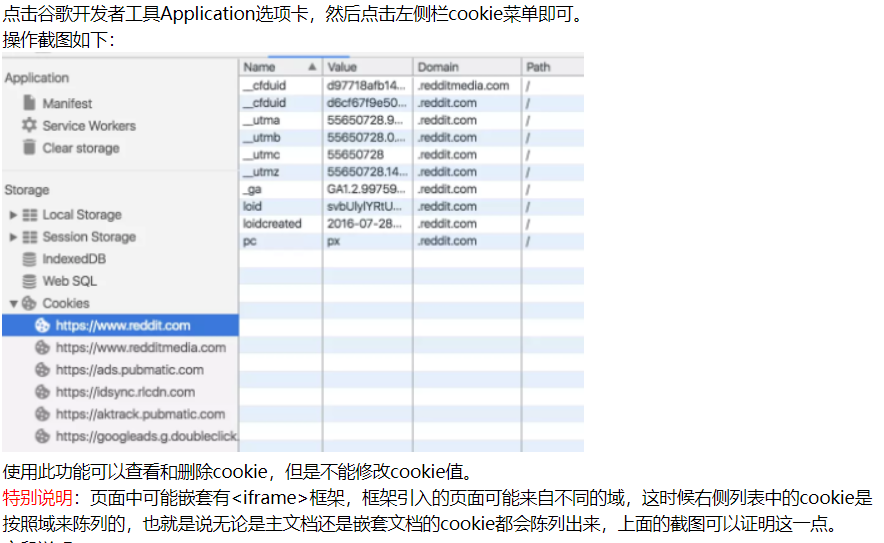

# 计算机组成

- 处理器 ： cup gpu
- 存储器 ： 内存 硬盘
- 控制器 ： 主板上的一些器件
- 输入设备 ： 鼠标 键盘 麦克风 网口
- 输出设备 ： 显示器 耳机 网口

# IP

## 分段

- A 1.0.0.1—127.255.255.254 10.0.0.0-10.255.255.255 127.X.X.X
- B 128.0.0.1—191.255.255.254 172.16.0.0—172.31.255.255 169.254.X.X
- C 192.0.0.1—223.255.255.254 192.168.0.0-192.168.255.255
- D 224.0.0.1—239.255.255.254
- E 240.0.0.1—255.255.255.254

## 向浏览器地址栏输入一个 url 回车之后，网络中都会发生什么

1. 看浏览器的缓存
2. 本机 host

   - 浏览器不缓存本机 ip
   - c:windows/system32/drivers/etc/host
   - 127.0.0.0
   - 0.0.0.0 表示不知道 ip，也会定位到本机

3. 家里的路由器
4. 上级路由、城市的 LDNS 服务器
5. 继续向上级的 DNS 服务器找
6. 全局的 DNS 服务器
7. 返回的时候每一级都会记下来结果映射，下次再访问的时候就可以直接拿到结果了

# 网络模型

1. 应用层 http dns
2. 运输层 tcp udp
3. 网络层 ip
4. 数据链路层 mac 地址
5. 物理层 高低电平
   

# http 协议

## 请求 Request

GET /s?ie=utf-8&mod=1&isbd=1&isid=75AE6ECAF9A53222&ie=UTF-8&wd=hello&rsv_sid=30970_1438_31123_21121_30825_31186_31229_30824_31163_31195&\_ss=1&clist=&hsug=&f4s=1&csor=5&\_cr1=11809 HTTP/1.1
请求方式 url(路径+参数) 协议版本
属性:值

## 响应 Response

HTTP/1.1 200 OK
协议版本 状态码 message
属性：值

## get 与 post

1. 基于什么前提？如果是什么前提都没有，不适用任何规范，只考虑语法和理论上的 http 协议。====get 与 post 几乎没有区别 只是名字不一样
2. 如果基于 RFC 规范
3. 理论上(specification)：GET 与 POST 是具有相同语法的但有不同语义，get 用来获取数据，post 用于发送数据，其他方面没有区别
4. 实现上(implementation):各种浏览器，就是这个规范的实现者。

- get 的参数在 URL 中可见，post 请求不显示在 URL 中
- get 对参数的长度是有限制的，post 长度没有限制
- get 请求的数据可以收藏为书签，post 请求到的数据不可以收藏为书签
- get 请求后，按后退按钮，刷新按钮无影响，post 数据会被重新提交
- get 编码类型：application/x-www-form-url,post 的编码类型有很多种 encodeapplication/x-www.form-urlencoded，mutipart/form-data
- get 历史参数会被保留在浏览器里，post 不会保存在浏览器中。
- get 参数只允许 ascII(中文会被转化为%...%),post 没有编码限制，允许发送二进制(文件)
- get 安全性较差，因为所发送的数据时 URL 的一部分

## 发送请求的方式

1. 在浏览器中直接输入网址
2. location.href 可以发送请求，但是会刷新页面
3. 带有 src 属性的标签。请求可以发出，服务端也可以处理，也可以返回结果，也可以正常的接受到结果。但是返回的结果要看标签是否能应用 img script iframe
4. 带有 href 属性的标签，请求可以发出，服务端也可以处理，也可以返回结果，也可以正常的接受到结果。但是返回的结果要看标签是否能应用 link a
5. 带有 action 属性的标签 form，但是发出请求之后，页面会跳转
6. ajax 可以用代码控制，页面不会跳转，返回的结果可以用 js 自行处理

# 跨域

## 资源是否限制跨域

1. js 文件，css 文件，jpg png 文件不受跨域限制。即 src 属性的资源都是可以跨域请求，href 属性的资源大部分都是可以跨域请求
2. 验证跨域的资源

- 后端接口的数据
- 其他域的 cookie
- 其他域的缓存

##怎么样算跨域
协议 域名 端口号 有任意一个不一样就算跨域

##跨域过程
跨域这个行为，发生在那里？

1. 即使跨域了，请求也可以正常发出
2. 服务器端也可以正常接受
3. 服务器也可以正常处理
4. 服务器也可以正常返回结果
5. 浏览器也可以正常接受到这些数据
6. **接受到后，发现当前页面的域和请求的域不同，所以判定为跨域**
7. 我们的代码在这里等着结果呢，但是因为浏览器判定为跨域了，不会把结果传递给我们的代码

## 解决跨域

1. 后端(别人家的)配合我们进行跨域

- JSONP 只能使用 get 方法，jquery 中设置了 post 方法，如果不是同源，都会自动改为 post
- 后端设置 Access-Control-Allow-Orifgin 属性以支持跨域

2. 没有后端配合

- 使用 iframe 只能显示不能控制
- 通过后端代理(自己的后端)

### jsonp

script 标签不受跨域限制，且会将返回结果直接执行，所以我们后端返回一个函数的执行，并且前端定义这个函数，参数是我们需要获取的数据，那么我们就能通过跨域获取到数据

#网络请求

## 原生代码

```
       var xhr = null;
        if (window.XMLHttpRequest) {
            xhr = new XMLHttpRequest();
        }else{
            xhr = new ActiveXObject("Microsoft.XMLHTTP");
        }
        xhr.onreadystatechange = function () {
            console.log(xhr.readyState, xhr.status);
            if (xhr.readyState == 4 &&  xhr.status==200) {
                console.log(xhr.responseText);
            }
        }
        xhr.open('get', 'https://developer.duyiedu.com/edu/testAjaxCrossOrigin',true);
        xhr.send();
```

## open

open 的第三个参数表示是否异步 默认为 true

## readyState

- 0 请求未初始化
- 1 服务器已经建立连接 open 之后
- 2 请求已接收
- 3 请求处理中
- 4 请求已成功，且响应就绪
- 可以使用 onreadystatechange 监听 0 不会监听到 一般也就监听 4

## status

- 1\*\* 信息，服务器收到请求，需要请求者继续执行操作
- 2\*\* 成功
- 3\*\* 重定向
- 4\*\* 客户端错误
- 5\*\* 服务器错误

## responseText

返回结果 正常都是 json 字符串

# 详解跨域

## 客户端与服务器端

### jsonp

1. 原理：script 标签不受跨域限制，且将请求到的内容直接执行
2. 通过 srcipt 标签请求数据,前端传递一个 callback 参数

```html
   <script>
        function test1(data){
            console.log('test1',data);
        }
    </script>
    <script src="http://localhost:3000/data?callback=test1">
```

3. 后端获取到参数将要返回的数据包裹

```js
var callback = query.callback;
response.write(`${callback}(${JSON.stringify(resultData)})`);
```

4. 也可以用 js 代码创建一个 script 标签，需要请求的时候再将其插入到 dom 中
5. jquery 的 ajax 可以将 dataType 属性设置为 jsonp。

###服务器代理

1. 原理： 同源策略是浏览器提出的，服务器与服务器之前没有跨域限制
   

2. 代码
<details>
<summary>展开:详细见机器人</summary>

```js
var http = require("http");
var url = require("url");
var fs = require("fs");
var req = require("request");
var path = require("path");
http
  .createServer(function (request, response) {
    var pathName = url.parse(request.url).pathname;
    var params = url.parse(request.url, true).query;
    console.log(pathName);
    if (pathName == "/chat") {
      var data = {
        reqType: 0,
        perception: {
          inputText: {
            text: params.text,
          },
        },
        userInfo: {
          apiKey: "0e6e6058578344789a8820de7b541cc1",
          userId: "123456",
        },
      };
      var contents = JSON.stringify(data);
      req(
        {
          url: "http://openapi.tuling123.com/openapi/api/v2",
          method: "POST",
          headers: {
            "content-type": "application/json",
          },
          body: contents,
        },
        function (error, resp, body) {
          if (!error && resp.statusCode == 200) {
            var head = {
              //"Access-Control-allow-Origin":"*",
              //"Access-Control-allow-Methods":"get,post",
              //"Access-Control-allow-Headers":"x-requested-width,content-type",
              //"Content-type":"application/json"
            };
            response.writeHead(200, head);
            var obj = JSON.parse(body);
            if (
              obj &&
              obj.results &&
              obj.results.length > 0 &&
              obj.results[0].values
            ) {
              response.write(JSON.stringify(obj.results[0].values));
              response.end();
            } else {
              response.write('{"text":"不知道你在说什么"}');
              response.end();
            }
          } else {
            response.writeHead(400);
            response.write("数据异常");
            response.end();
          }
        }
      );
    } else {
      try {
        var file = fs.readFileSync(path.resolve(__dirname, "../" + pathName));
        response.writeHead(200);
        response.write(file);
        response.end();
      } catch (error) {
        console.log(error);
        response.writeHead(404);
        response.write("<html><body><h1>404 notfound</h1></body></html>");
        response.end();
      }
    }
  })
  .listen(3000);
```

</details>

### CORS

cross origin resource sharing 跨域资源共享

#### 简单请求与非简单请求

- 简单请求 同时满足以下两个条件就是简单请求
  - 请求方法只能是 get head post
  - HTTP 的头部信息不能超出一下几种字段
  - Accept
  - Accept-language
  - Content-language
  - Last-Event-ID
  - Content-type 只限于三个值 application/x-www-form-unlencoded 、 multipart/form-data 、text/plain
- 非简单请求
- 不是简单请求就是非简单请求
- 非简单请求指的是对服务器有特殊要求，比如请求方法为 put，delete、或者 content-type 为 application/json
- 浏览器对于非简单请求会进行一次预检 即 options 请求，浏览器会先询问服务器，当前网页所在的域名是否在服务器许可的名单中，以及可以使用哪个请求方法和头部字段，如果通过了服务器的校验，才会发起正式的 xmlhttprequest，否则报错

#### 解决跨域

- 简单请求

  - 只需要在服务端请求头中设置 "Access-Control-Allow-Origin" : "\*"

- 非简单请求
- 对于跨域请求需要设置"Access-Control-Allow-Origin" : "\*"
- 对于非 get post head 方法请求需要设置"Access-Control-Allow-Methods":"PUT,Delete" 方法可以用，分割
- 对于设置了其他请求头字段，需要设置"Access-Control-Allow-Headers":"content-type" 请求头字段可以用，分割

## 客户端与客户端

### iframe 跨域

```html
<iframe src="https://www.baidu.com/" id="ifr"></iframe>
```


可以在父页面访问 ifr.contentWindow 来获取 iframe 的 window，但是不能继续获取属性

#### 通过 window.name 及 window.location.hash 传递数据

- 子页面向父页面传递数据
- name 属性比较特殊,同一个窗口中，改变的 url 其 name 属性不变
- 子页面加载完成之后说明子页面的同步代码已经执行完成了，此时 name 属性已经有值了
- 可以在子页面加载完成之后将 iframe 的 src 替换成一个与父页面同域的中间页面，此时访问 ifr.contentWindow.name 不受跨域限制且可以拿到子页面设置的值

```js
//子页面中
window.name = "index1";

//父页面中
var flag = false;
ifr.onload = function () {
  if (!flag) {
    ifr.src = "./demo.html";
    flag = true;
  } else {
    console.log(ifr.contentWindow.name);
  }
};
```

- 父页面向子页面传递数据
- decodeURI() 函数可对 encodeURI() 函数编码过的 URI 进行解码。
- decodeURIComponent() 函数可对 encodeURIComponent() 函数编码的 URI 进行解码。
- 出现中文可用上述方法进行解码，encodeURIComponent 可以对# ？等特殊符号进行编码而 encodeURI 不会

```js
//父页面
ifr.src += "#" + "index";

//子页面
console.log(window.location.hash);
```

#### postMessage 与 onmessage

不仅适用于 iframe，通过 window.open()以及任何两个页面都可以通过相互传递数据

```js
//一个页面
var data = {
  name: "father",
  age: 40,
};
ifr.onload = function () {
  ifr.contentWindow.postMessage(data, "http://127.0.0.1:5500");
};
window.onmessage = function (e) {
  console.log(e.data);
};
// 另外一个页面
var data = {
  name: "son",
  age: 18,
};
window.parent.postMessage(data, "http://127.0.0.1:5501");
window.onmessage = function (e) {
  console.log(e.data);
};
```

#### document.domain

使用条件：

- 有其他页面 window 对象的引用。
- 二级域名相同。qq.com
- 协议相同。https
- 端口相同。443
  

# 跨域携带 cookie

1. 同域请求会自动携带 cookie，跨域请求则不会携带 cookie
2. cors 只是解决了跨域请求问题，可以请求，但还是不会携带 cookie
3. 需要前端设置 withCredentials 为 true，此时才会携带上 cookie，同域请求这个参数无效
4. 后端需要设置 Access-Allow-Control-Credentials 为 true
5. 后端不能将 Access-Alllow-Control-Origin 为\*,必须为指定的域，request.getHeader("Origin")

# 请求过程



# 关于 cookie

- 浏览器 application 中 cookie 只能看到本网站域的 cookie 以及 iframe 的 cookie，无法看到跨域后台设置的 cookie
  
- document.cookie 只能获取本域中 http-only 为 false 的 cookie，可以通过 document.domain 查看本域
- baidu.com 为父域，zhidao.baidu.com 和 xinwen.baidu.com 为子域
- 子域可以读取父域的 cookie，父域不可以读取子域的 cookie
- 前端设置 cookie 的 domain 只能为本域或者父域
- 后端设置了 cookie，会在 response 中返回头字段 setcookie,浏览器会将 cookie 设置在后端的域下，如果是跨域那么在 application 中的 cookies 中是看不到的，但其实是设置了。
- 非跨域情况下 xhr 请求会自动带上 cookie
- 跨域情况下 xhr 请求需要将 withCredentials 设置为 true，且后端设置 Access-Control-Allow-Credentials 设置为 true,且 Access-Control-Allow-Origin 不能为\*
- [cookie 详解](https://blog.csdn.net/playboyanta123/article/details/79464684)
- [谷歌浏览器管理 cookie](https://www.softwhy.com/article-10225-1.html)
- [chrome 开发工具官网](https://developers.google.com/web/tools/chrome-devtools) [中文版 1](https://www.softwhy.com/article-8866-1.html) [中文版 2](https://www.html.cn/doc/chrome-devtools/)
